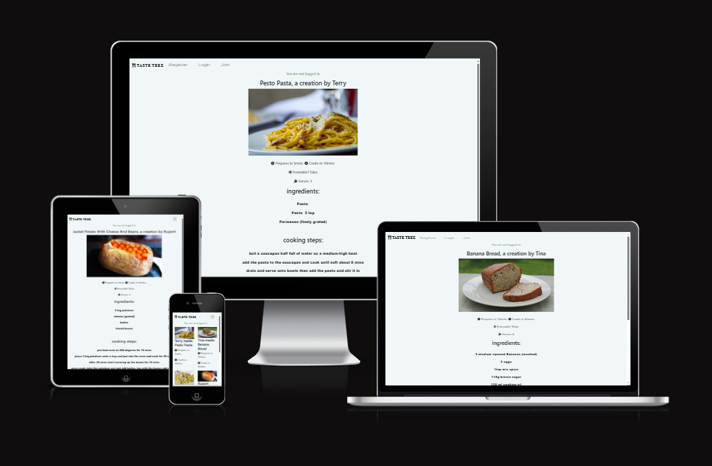

# TASTE TEEZ
#### Responsive

- check it out below

Taste Teez allows users to share various recipes. Similair to an online cookbook designed so users can have there own recipes and see what other users have added.
#### Colour Scheme

I decided on a few contrasts i thought represented a nice restaurant, the idea was to make the food seem even more appealing to the user
#### Audience and purposes
- Audience
The people this would likely be aimed at would be anybody who spends time in the kitchen and enjoys to cook. 
- purposes
uploading recipes and sharing ideas. users will have full control over what they create edit and delete.
#### User Stories
-as a i can so that
#### Kanban Board

#### Features Coming Soon
- a search function to search for recipes
- a likes counter and favourite a recipe
#### Database Diagram

#### Site Map (must edit)
