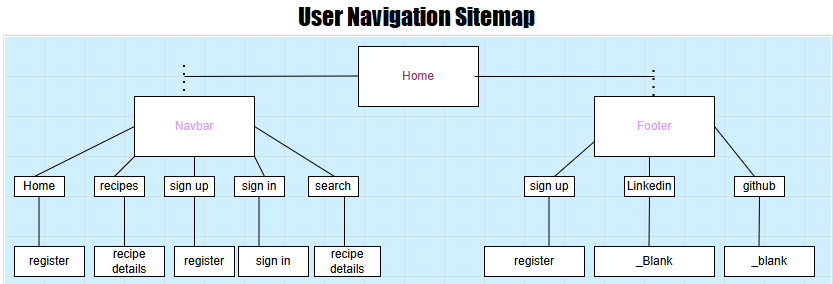

### TASTE TEEZ

#### Responsive

#### Link to Website Below
https://tastetease-5c0e63de4c45.herokuapp.com/

- Taste Teez is a site for sharing recipes. Similair to an online cookbook designed so users can have there own recipes and see what other users have added.

#### Fonts Used
- I chose  two different fonts: 'Michroma' for the page links and 'Philosopher' for the recipe headings

#### Colour Scheme
- these colours represent a nice restaurant, it makes the food image pop and appeal to the user

- #` F1F7F8 This Anti-flash shade was used for the navbar, footer text, and a subheading
- #` 12242B This Gunmetal shade was used as my main abckground colour
- #` 688E26 This Avocado shade was used for all other text mainly paragraph text

#### Audience and purposes
- Audience
The people this would likely be aimed at would be anybody who spends time in the kitchen and enjoys to cook. 
- purposes
uploading recipes and exchanging comments. users will have full control over what they create edit and delete.

#### User Stories
- As a signed in user I can create a recipe So that I can see my recipes
- As a logged in user I can manage my recipes So that I have control over what i post
- As a signed in user I can delete a recipe So that I have control over what recipes exist
- As a signed in user I can edit a recipe So that i can change it when i need to
- As a user i can create an account so that i have a signed in user
- As admin I can utilise the admin dashboard so that i can use backend functions
- As a signed in user I can leave comments on recipes which brings user interaction

#### Features Coming Soon
- a search function to search for recipes
- a likes counter
- a favourite recipes page

#### Kanban Board

#### Database Modele

#### Database Diagram

#### Site Map

### Lofi Wireframes
#### Desktop Signed In

#### Desktop Signed Out

#### Mobile Signed In

#### Technologies Used
- Python3
- HTML5
- CSS3

#### Libraries and Other Packages Used
- CI Database - Allowed me to host a database in a postgres link
- Git - an open source version control system which tracks any changes to my code used for development
- GitHub - Where my main repository is hosted 
- Google Fonts - An online Library used for collecting fonts i used 'Michroma' and 'Philosopher'
- Django Database - allowed me to connect to DATABASE_URL environment variable which is linked to my relational database in the Django Recipe app
- Bootstrap - A tool used for making the website responsive and appealing
- Beautify - an extension for the Gitpod IDE. It formatted my code for a clean human readable look
- Font Awesome - An online library used for a clock, pizza slice, and snowflake icon
- Am I Responsive - a visual responsive idea of how my website looks on different screens
- Heroku - A cloud based hosting service which I used to deploy my website with, It gives you detailed build logs on manual deployment
- Paint - was used for image resizing and editing
- Unsplash/Pexels - were used for downloading all the images which are royalty free
- Django - an MVC Framework which I built the website with 
- Gunicorn - A server for the WSGI application  
- Balsamiq - Wireframe creation tool
- Coolors - was used to decide on a color scheme
- Cloudinary - An online Hosting provider to store dynamic images, this doesnt require a local image folder to store my images
- GitPod – An IDE which was used to code everything and display different file types to work with
- Django Summernote - a package to enhance UX when entering text into text fields 

W3C Markup Validator 

W3C CSS Validator 

#### Testing

#### Encountered Issues
- images that are uploaded are all different sizes, this gives the website an irregular look which was frustrating, i ended up resizing them in paint
but it would be good if i could force an image size on upload
- in mobile view the recipes arent vertically aligned ina single column
- My comments were showing but randomly stopped so i decieded to leave them out

#### Deployment
- Heroku was used to deploy my website. this lets me manage my app in the cloud aswell as allows me to use microservices for site users

#### Credits
- 