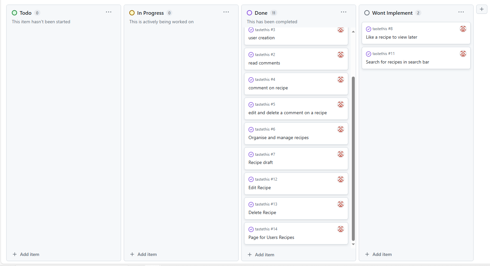

### TASTE TEEZ

#### Responsive

#### Link to Website Below

- Taste Teez is a site for sharing recipes. Similair to an online cookbook designed so users can have there own recipes and see what other users have added.

#### Colour Scheme

I decided on a few contrasts i thought represented a nice restaurant, the idea was to make the food seem even more appealing to the user

#### Audience and purposes
- Audience
The people this would likely be aimed at would be anybody who spends time in the kitchen and enjoys to cook. 
- purposes
uploading recipes and exchanging comments. users will have full control over what they create edit and delete.

#### User Stories
- As a signed in user I can create a recipe So that I can see my recipes
- As a logged in user I can manage my recipes So that I have control over what i post
- As a signed in user I can delete a recipe So that I have control over what recipes exist
- As a signed in user I can edit a recipe So that i can change it when i need to
- As a user i can create an account so that i have a signed in user
- As admin I can utilise the admin dashboard so that i can use backend functions
- As a signed in user I can leave comments on recipes which brings user interaction

#### Features Coming Soon
- a search function to search for recipes
- a likes counter and favourite a recipe

#### Kanban Board

#### Database Diagram

#### Site Map

### Lofi Wireframes
#### Desktop Signed In

#### Desktop Signed Out

#### Mobile Signed In

